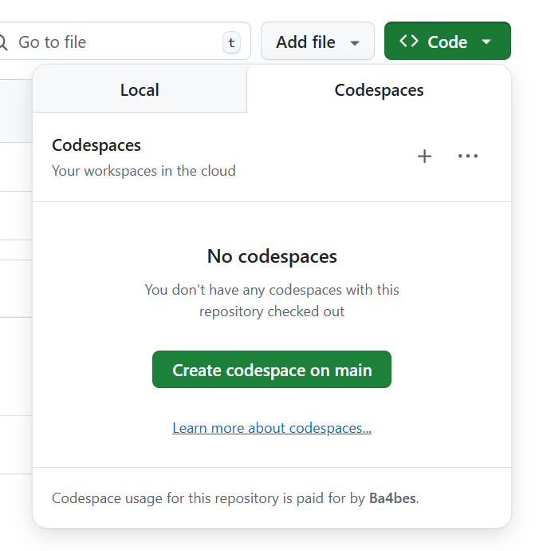
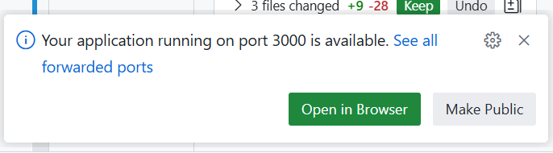
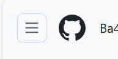

## 1. Starting a GitHub Codespace from the repository

1. Navigate to your GitHub repository
2. Click on the "Code" button (green button)
3. Select the "Codespaces" tab
4. Click "Create codespace on main" (or your current branch)
5. Wait for the codespace to initialize



## 2. Interact with your Codespace
1. Once the codespace is ready, you will be taken to a web-based version of Visual Studio Code
2. Open a terminal in the codespace by pressing `Ctrl + ` (backtick) or by navigating to "Terminal" > "New Terminal" from the hamburger menu
3. Run the following commands to navigate to the project directory and start the application:
```
cd "01hello_world"
npm start
```
4. Change `World` in `index.js` to your name and see the change reflected in the terminal output
5. Run Ctrl + P to open the command palette, type `Color Theme` and select `Preferences: Color Theme`. Change the theme of your codespace

## 3. Work with a Web Application
1. Use the following command
    ```bash
    cd 02web_application
    npm install
    npm run dev
    ```
2. There should be a message at the bottom right. Press "Open in Browser" 

3. Observe the web application in the browser. Look at the URL. Compare the URL to the URL of your codespace
4. Make a change to the `server.js` file. CHhange the text `Hello World` to `Hello <your name>`. Save the file.
5. Refresh the browser window to see your changes reflected in the web application

## 4. Stop your Codespace
1. In the repository, again click on "code"
2. Click on the three dots (ellipsis) next to the codespace you want to stop
3. Select "Stop codespace" from the dropdown menu
4. Confirm the action if prompted

## 5. delete your Codespace
1. In the repository, again click on "code"
2. Click on the three dots (ellipsis) next to the codespace you want to delete
3. Select "Delete codespace" from the dropdown menu
4. Confirm the action if prompted

## 6. Start a new Codespace
1. Repeat the steps in section 1 to start a new codespace
2. Notice what happened to your changes and configuration

## 7. Commit a change from your codespace
1. Go to the `index.js` file and add a comment at the top of the file
```
// This is my first change from a Codespace
```
2. Commit and push the change to your GitHub repository by using the source control panel or with the terminal (note that git is already configured in the codespace)
7. Verify that the change has been pushed by checking the `index.js` file in the web interface of your GitHub repository

## 8. See your currently active Codespaces
1. Click on the hamburger menu in the top-left corner of GitHub
2. Select "codespaces" from the dropdown menu
3. You will see a list of your active codespaces
