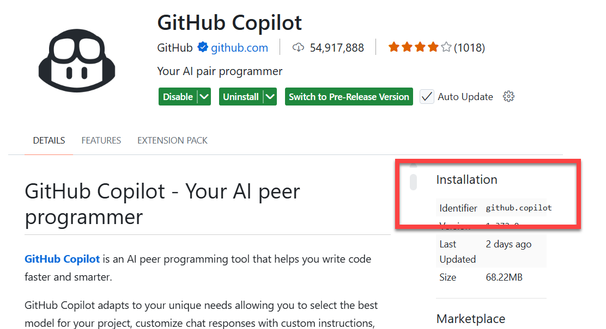

# Lab: Build a Dev Container

In this lab, you will create a dev container file to use with your codespace.
You can choose to create a container that works with:
- Node.js
- Python
- .NET

If you want to use another language, you need to create your own testing application.

## 1. Create a devcontainer via Command Palette

1. Open the Command Palette (`Ctrl+Shift+P` or `F1`).
2. Run: “Codespaces: Add Dev Container Configuration Files…”.
3. Choose "Create a new configuration".

4. Choose a starting definition, depending on your prefered app (e.g., Node.js). If you cannot find the definition you want, click "Show All Definitions..."
5. If you are asked what version you want, choose the default
6. When prompted to add optional features, select "GitHub CLI". Keep the defaults
7. A pop-up will appear asking if you want to rebuild the container, select "Rebuild Now".

8. Wait for the container to build. This may take a few minutes. When it is ready, notice the new file that has been created in the `.devcontainer` folder

5. If prompted, Reopen in Container / Rebuild.


## 2. Add a feature to `devcontainer.json`

>With features, you can quickly add tools, runtimes, or libraries to your dev container configuration.

1. Open `.devcontainer/devcontainer.json`. 

>With features, you can quickly add tools, runtimes, or libraries to your dev container configuration.

2. Go to this website and take a look at the possibilities: https://containers.dev/features
3. Add the AWS CLI or the Azure CLI feature (whichever you prefer) to your `devcontainer.json` file. Use the reference from the website  It should look something like this:

```json
{
  "name": "app-dev",
  "image": "[IMAGE NAME]",
  "features": {

    "ghcr.io/devcontainers/features/aws-cli:1": {}
  }
}
```
4. Rebuild the container when prompted and check if the new feature is installed by running `aws --version` or `az --version` in the terminal.

## 3. Add default editor settings

1. 
1. In the `devcontainer.json` file, add the following settings to disable the minimap in your codeview.

```json
{
  "name": "app-dev",
  "image": "[IMAGENAME]]",
  "features": {
  },
  "settings": {
    "editor.minimap.enabled": false
  }
}
```
2. Rebuild the container when prompted and check if the new setting is applied by opening a code file and checking if the minimap is disabled.
3. Remove this setting. This setting is used as an example because it is easy to see if it is applied or not, but it is not fitting as a setting for a project.
4. Add a setting that you would like to have as a default for your project. For example, you can set the default terminal to bash.
5. Rebuild the container when prompted and check if the new setting is applied by opening a code file and checking if the setting is applied.

## 4. Install extensions

1. In the `devcontainer.json` file, add the most important extension (in your opinion) for the language you are working with. The format is as follows:

```json
{
  "name": "app-dev",
  "image": "[IMAGENAME]]",
  "features": {
  },
  "settings": {
    "editor.minimap.enabled": false
  },
  "customizations": {
    "vscode": {
      "extensions": [
        "[Extension ID]",
        "[Extension ID]"
      ]
    }
  }
}
```

You can find the extension ID here:



## 5. Forward a port
> You can forward ports in your codespace to test and debug your application. You can also manage the port protocol and share the port within your organization or publicly.

1. In the `devcontainer.json` file, add the following code to forward port 3000 and open a browser when the port is forwarded.

```json

"forwardPorts": [3333, 4444],

"portsAttributes": {
  "3333": {
    "label": "app02"
  },
  "4444": {
    "label": "app03"
  }
}

```
2. Rebuild the container when prompted and check if the port is forwarded by running your application and checking if the port is forwarded.


## 6. Create a postcreate command

1. In the `devcontainer.json` file, add the following code to get a message after startup

```json
{
  "postCreateCommand": "echo 'Welcome to your dev container!'"
}
```
2. Rebuild the container when prompted and check if the message is displayed in the terminal after the container is started.


## 7. Switch to a custom Dockerfile

> You can use a custom Dockerfile to create your own image. This is useful if you need to install additional software or if you want to use a different base image.

1. Action: Create a new file called `.devcontainer/Dockerfile`
2. Add the following code to the file:

```Dockerfile
# Base image: Ubuntu-based dev container
FROM mcr.microsoft.com/devcontainers/base:ubuntu

# Install basic tools and Node.js
RUN apt-get update \
    && apt-get install -y curl ca-certificates build-essential \
    && rm -rf /var/lib/apt/lists/*

# Install Node.js 20
RUN curl -fsSL https://deb.nodesource.com/setup_20.x | bash - \
    && apt-get update \
    && apt-get install -y nodejs \
    && rm -rf /var/lib/apt/lists/*

# Create non-root user for VS Code
ARG USERNAME=vscode
ARG USER_UID=1000
ARG USER_GID=$USER_UID

RUN groupadd --gid $USER_GID $USERNAME \
    && useradd -s /bin/bash --uid $USER_UID --gid $USER_GID -m $USERNAME \
    && apt-get update && apt-get install -y sudo \
    && echo $USERNAME ALL=\"(ALL) NOPASSWD:ALL\" > /etc/sudoers.d/$USERNAME \
    && chmod 0440 /etc/sudoers.d/$USERNAME

# Switch to non-root user and set working directory
USER $USERNAME
WORKDIR /workspaces/CodeSpaces-Lab01

# Display a welcome message when container starts
RUN echo "echo 'Welcome to your custom dev container!'" >> ~/.bashrc


```

## 8. Point `devcontainer.json` at your Dockerfile

1. Open `.devcontainer/devcontainer.json`.
2. Action: Replace `image` with a `build` section and keep prior config.

```json
{
  "name": "app-dev",
	"build": {
		"dockerfile": "Dockerfile"
	}
  
}
```
3. Rebuild the container when prompted. You have now used the Dockerfile to create your own image.

